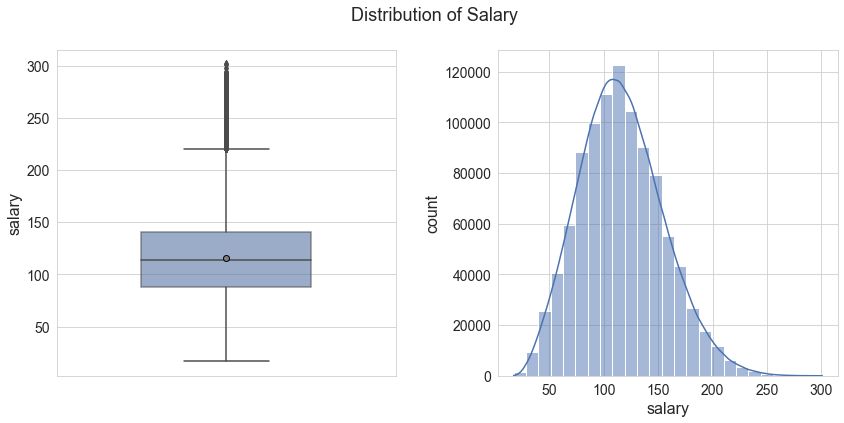
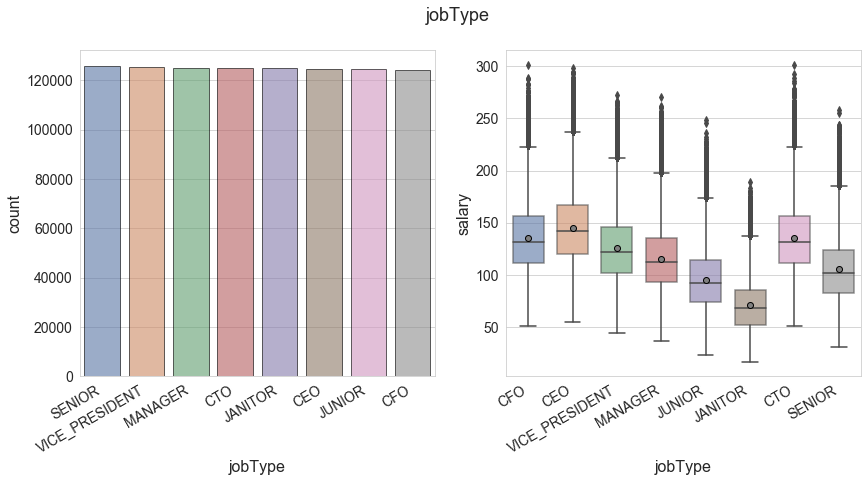
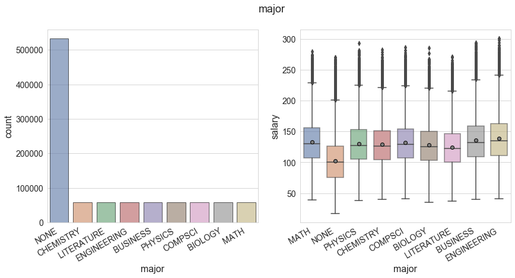
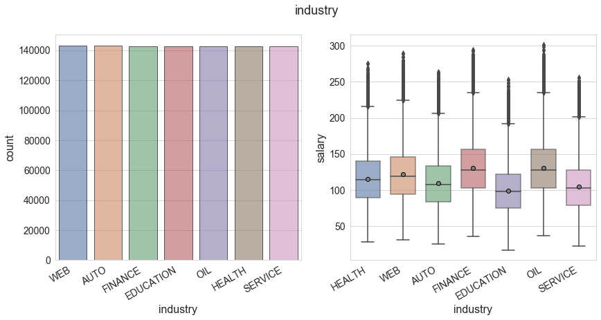
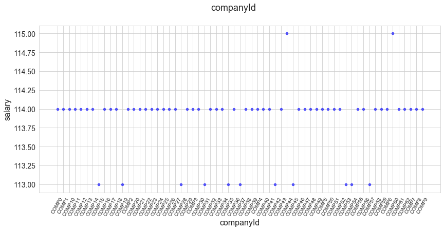

# Salary Prediction based on Job descriptions
## Problem Overview
The goal of this project is to predict the missing salaries of the unseen job postings by analyzing a dataset about job postings and their corresponding salaries.

The possible use-case for this project is for the websites showing job postings to give a better estimate of the salaries and to give job seekers an idea about the salaries based on their credentials.

## Data Exploration
### Checking out the data
Following datasets are provided for this project in the CSV format:
- `train_features.csv`: As name suggests, this dataset contains the training data in tabular form with all the features. It contains 1 million records and each one of them corresponds to a job listing. All the records contain 8 features which are described as follows:
    
    * `jobId` (str): Unique identifier for each job listing
    
    The following features are the categorical variables in the dataset:
    * `companyId` (str): Categorical variable representing a unique identifier for each company. Total of 63 different companies have their job listings in the dataset
    * `jobType` (str): Examples: CEO, CFO, Manager, etc.
    * `degree` (str): Examples: Bachelors, Masters, Doctoral, etc.
    * `major` (str): Examples: Biology, Engineering, Math, etc.
    * `industry` (str): Examples: Web, Finance, Health, etc.

    There are two numeric features in the dataset:
    * `yearsExperience` (int): Number of years of experience
    * `milesFromMetropolis` (int): Distance between a job's location and nearest metropolis

- `train_salaries.csv`: Dataset containing the target variable (`salary`) for each job listing of the `train_features.csv`.
- `test_features.csv`: The unseen job listings missing the target variable. Our goal is to predict the salary for these 1 million records.

All of this data is available in the data directory (_not included in the repo_). 
The `train_features.csv` and `train_salaries.csv` files are loaded as pandas dataframe and merged together in a single dataframe

### Data Cleaning
There are certain things we want to investigate for data cleaning:
- Presence of any missing or duplicate data
- Check if there is any invalid data i.e. records with negative salaries

These cases need to be pre-precessed (imputation or removal of records) before going into any modelling step. Same procedure is applied to test data as well.

It is found that the data is pretty much clean with no duplicate or missing values. There are, however, 5 training records with zero salary, they are not very interesting to us so we just removed them.

### Data Visualization
Visualization part of the data involves the visualizing the trends and summaries of various features and target variable and to plot their correlation with each other. Let's start with the target variable first:

__1. Target variable: `salary`__

As we can see, salary is slightly right skewed which should not be surprising since there are only a handful of people with very high salaries in a typical salary distribution. Most of the salaries are located in around the range 85-140 with the median value of about 115. Also, the mean and the median values are almost coinciding meaning the distribution is almost symmetrical.

We will explore the numeric features now.

__2. `yearsExperience`__

Apart from relatively small fluctuations, data is almost evenly distributed between the unique values of the `yearsExperience`. There are only 25 unique integer values for this feature, meaning, it might as well be considered as an ordinal categorical variable. We kept it as a numeric variable though since there is a non-zero positive correlation between `salary` and `yearsExperience` as shown by the right plot above.

__3. `milesFromMetropolis`__

Again, we can clearly see that data is pretty much evenly distributed between all the values of `milesFromMetropolis`. Interestingly the salaries decrease as we move farther from the big cities. This might be due to the fact that bigger cities have higher cost of living so the companies there pay you more.

We will continue our analysis with the categorical features now.

__4. `degree`__

The corresponding data table for the target variable for the unique values for this feature looks like:
| degree | mean | count |
| :---: | :---: | :---: |
| BACHELORS | 125.45 | 175495 |
| DOCTORAL	| 135.50 | 175362 |
| HIGH_SCHOOL | 101.92 | 236975 |
| MASTERS | 130.51 | 175310 |
| NONE | 98.176882 | 236853 |

We can easily infer that advanced degrees like Ph.D. and masters indeed help in getting big salaries. There is a category with name `NONE` in this feature. This is probably those records for which the `degree` is not reported.

__5. `jobType`__

Data table:
| jobType | mean | count |
| :---: | :---: | :---: |
| CEO | 145.311425 | 124778 |
| CFO | 135.458547 | 124369 |
| CTO | 135.481067 | 125045 |
| JANITOR | 70.813045 | 124971 |
| JUNIOR | 95.333087 | 124592 |
| MANAGER | 115.368518 | 125120 |
| SENIOR | 105.487775 | 125886 |
| VICE_PRESIDENT | 125.368630 | 125234 |

There is a clear trend of `jobType` with `salary` as CEO, CFO, and CTO are high paying jobs whereas the median salary of junior and janitor level roles is comparatively quite low.

__6. `major`__

| major | mean | count |
| :---: | :---: | :---: |
| BIOLOGY | 127.932664 | 58379 |
| BUSINESS | 135.648980 | 58518 |
| CHEMISTRY | 129.072085 | 58875 |
| COMPSCI | 132.075605 | 58382 |
| ENGINEERING | 138.441342 | 58594 |
| LITERATURE | 124.423097 | 58684 |
| MATH | 133.322042 | 57800 |
| NONE | 102.583864 | 532353 |
| PHYSICS | 130.372436 | 58410 |
Listings with majors like Engineering, Business and Maths have high salaries. There is a category called `None` which probably means either it is not reported or the major is not any of the listed categories.

__7. `industry`__

| industry | mean | count |
| :---: | :---: | :---: |
| AUTO | 109.435222 | 142941 |
| EDUCATION | 99.448386 | 142819 |
| FINANCE | 130.747659 | 142866 |
| HEALTH | 115.735540 | 142755 |
| OIL | 130.953863 | 142770 |
| SERVICE | 104.446820 | 142639 |
| WEB | 121.645362 | 143205 |
The dataset is also almost uniformly distributed between various industries. Oil and Finance sector pay their employees more salaries as compared to other industries.

__8. `companyId`__

The above plot shows the median salaries of all the 63 unique companies. Most of the companies have their median salary of about 114k.  